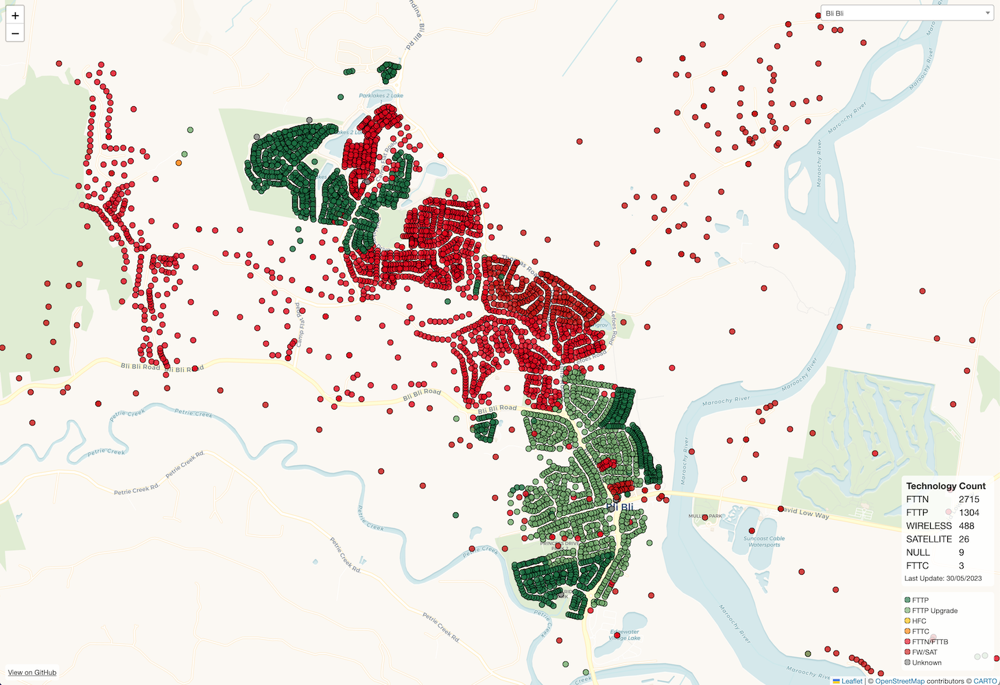
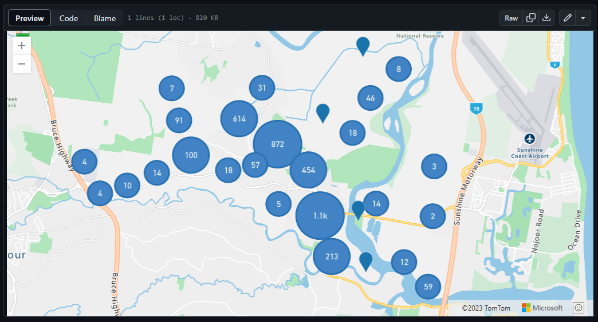

# NBN FTTP Upgrade Map


The Australian National Broadband Network (NBN) announced an on-demand upgrade program for select premises serviced via Fibre to the Node (FTTN) and Fibre to the Curb (FTTC) to Fibre to the Premises (FTTP) in October 2020.

NBN has progressively announced towns and suburbs where FTTN users will be eligible for a FTTP upgrade (FTTC areas aren't disclosed by NBN).

The details regarding actual availability of the program are limited with not all households in announced suburbs eligible for upgrades.

To address these concerns this project runs automated checks against the announced suburbs to generate interactive maps showing which premises are ready to upgrade.  You can see the current version of this data at <https://lukeprior.github.io/nbn-upgrade-map/>



## Tech Explanation

To know what premises reside within a given town/suburb the [Geocoded National Address File of Australia (GNAF)](https://data.gov.au/dataset/ds-dga-19432f89-dc3a-4ef3-b943-5326ef1dbecc/details) is used which contains 15.4 million Australian addresses. This dataset is provided over multiple files and requires significant processing before it can easily be used with a databse solution such as PostgreSQL, Hugh Saalmans has created [gnaf-loader](https://github.com/minus34/gnaf-loader) a Docker container which contains the GNAF dataset and administrative boundaries in PostgresSQL which is used. He has also created a slide-deck explaining the dataset which is available to view [here](https://minus34.com/opendata/georabble-intro-to-gnaf.pdf).

To check each address the NBN places APIs are used both to determine the LocID for a given address and then the premise details. These APIs are the same ones used on the main NBN Fast Fibre [website](https://www.nbnco.com.au/residential/upgrades/more-fibre). To speed up the process up to 20 simultaneous requests are made to these APIs by using the Python ThreadPool.

The results of these checks are stored in [GeoJSON](https://geojson.org/) files for each suburb containing the coordinates, street address, current NBN technology, NBN LocID, and NBN Fibre upgrade eligibility. These files can be found in the results folder and can be viewed from within GitHub.



To improve the user experience a simple site is available for viewing this data, the website uses Leaflet to display the selected data with colour coded markers and info popups containing additional information for each premise.

The updating of data is performed with a GitHub Actions workflow that accepts a target suburb and will automatically fetch and publish all the data.

If you would like to see an additional suburb added please open an issue.

## History

[](https://lukeprior.github.io/nbn-upgrade-map/stats)

## Running locally

To run the code on your local machine you will first need to setup the PostgreSQL database with the GNAF dataset.
We have developed a "cut down" version of the minus34/gnaf-loader image that includes just the data this program needs, and is ~3GB instead of the 32GB original.
The simplest way to do this is by running the Docker container with the following commands.

```shell
docker run --publish=5433:5432 lukeprior/nbn-upgrade-map-db:latest
```

The database can then be accessed at localhost on port 5433 with username: `postgres` and password `password`.

The repository can be cloned and from the main directory `main.py` can be run using `python code/main.py SUBURB STATE`.

The available SUBURB/STATE combinations can be found in results/all_suburbs.json while results/suburbs.json contains the suburbs announced by NBN to be upgraded to FTTP.

The results will be saved in the corresponding state folder in results.

To update the results/results.json file the results.py script can be run using `python code/results.py`

To view the results you will need a geojson viewer such as [geojson.io](https://geojson.io/) or modify the index.html file to load local files instead of those hosted on this repo.
